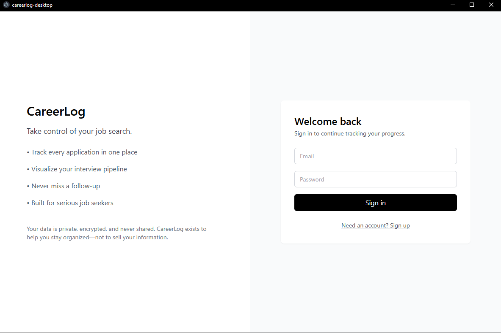

# CareerLog



**CareerLog is a job-application tracker** — it helps a job seeker manage their applications end to end: track each job's status through the hiring pipeline, attach résumés, and configure follow-up reminders, all from a native Windows desktop app backed by a secure REST API.

> Not ready to build from source? Jump to **[Download & Run the App](#-download--run-the-app-no-build-required)** to grab the latest installer.

---

## What CareerLog Does

- **Authenticate** — register, log in, and refresh a session.
- **Manage job applications** — create, view, update, and delete jobs, each with a title, company, URL, location, employment type, salary target/range, status, and an optional uploaded résumé.
- **Track the pipeline** — jobs move through statuses (`applied`, `interviewing`, `offer`, `rejected`), surfaced as a dashboard with status counts and a pipeline visualization.
- **Configure follow-up alerts** — schedule a reminder (`sms` or `email`) with a message and time. In v1, alerts are **configuration-only** — they are stored but not actually delivered.
- **Attach résumés** — upload one résumé per job; files are stored server-side in MongoDB GridFS and downloaded on demand.

### Non-goals (v1)
- No local authoritative data storage / offline mode on the client.
- No real-time updates or push.
- No actual SMS/email delivery or scheduled background execution.
- No business logic in the frontend beyond the API contract.

---

## Architecture at a Glance

CareerLog is split into two independently deployable parts that live side by side in this workspace. The backend owns all data, logic, and persistence; the desktop app is a thin, typed HTTP client that holds no authoritative state.

| Folder | Role | Stack |
| --- | --- | --- |
| [backend-app-tracker/](backend-app-tracker/) | REST API and source of truth | Python · FastAPI · MongoDB · JWT |
| [careerlog-desktop/](careerlog-desktop/) | Windows-first desktop client | Electron · React · TypeScript · Vite |

For the full design — request lifecycle, response envelope, auth/ownership model, and data model — see **[architecture.md](architecture.md)**.

```
careerlog-desktop (Electron + React)  ──HTTPS + Bearer JWT──▶  backend-app-tracker (FastAPI)  ──▶  MongoDB (+ GridFS)
```

---

## 📦 Download & Run the App (no build required)

End users do **not** need Python, Node, or this source tree. The desktop client ships as a packaged **Windows installer**.

1. Go to the **[Releases page](https://github.com/alex43002/app-tracker/releases)**.
2. Download the latest installer asset (`CareerLog Setup <version>.exe`) from **Assets**.
3. Run the `.exe` and follow the NSIS installer prompts. CareerLog installs and creates a shortcut.
4. Launch CareerLog and sign in. The app **requires a running CareerLog backend** (see [Backend setup](#1-backend--backend-app-tracker)); point it at your backend via the `VITE_API_BASE_URL` used at build time (defaults to `http://127.0.0.1:8000`).

Once installed, CareerLog **auto-updates** itself from GitHub Releases via `electron-updater` — new versions are picked up automatically.

> Releases are published to the [`alex43002/app-tracker`](https://github.com/alex43002/app-tracker) repository.

---

## Initialize & Run Locally (from source)

To run the full stack yourself you start the **backend first**, then the **desktop client**.

### Prerequisites

| Component | Requirement |
| --- | --- |
| Backend | Python 3.11+, pip, MongoDB (local or Atlas), Git |
| Desktop | Node.js 18+, npm (bundled with Node) |

### 1. Backend — [`backend-app-tracker/`](backend-app-tracker/)

```bash
cd backend-app-tracker

# Create and activate a virtual environment
python -m venv .venv
source .venv/bin/activate     # macOS/Linux
.venv\Scripts\activate        # Windows (PowerShell/cmd)

# Install dependencies
pip install --upgrade pip
pip install -r requirements.txt
```

Create a `.env` file in `backend-app-tracker/`:

```env
MONGODB_URI=mongodb://localhost:27017/jobtracker
MONGODB_DB_NAME=jobtracker
JWT_SECRET=replace-with-a-strong-secret
JWT_ALGORITHM=HS256
JWT_EXPIRY_HOURS=2
```

Run the API:

```bash
uvicorn app.main:app --reload
```

- API: `http://localhost:8000`
- Interactive docs (Swagger): `http://localhost:8000/docs`
- Health check: `http://localhost:8000/health`

Run the test suite:

```bash
pytest
```

### 2. Desktop client — [`careerlog-desktop/`](careerlog-desktop/)

```bash
cd careerlog-desktop

# Install dependencies
npm install

# Run in development (Vite dev server + Electron with hot reload)
npm run dev
```

Configure the backend URL with the `VITE_API_BASE_URL` environment variable (defaults to `http://127.0.0.1:8000`).

Build a production Windows installer locally:

```bash
npm run dist     # compiles main/preload, builds the renderer, and packages an NSIS installer
```

The installer is emitted by `electron-builder`.

---

## Contributing

Contributions are welcome. The two repositories are versioned against the **CareerLog API v1** contract — the uniform response envelope and pagination shape are the stable seam between them, so frontend and backend changes must stay in sync.

### Workflow

1. **Fork & branch** — create a feature branch off `main` (e.g. `feat/job-filters` or `fix/alert-validation`).
2. **Make focused changes** — keep backend and desktop changes coherent with the API contract. Breaking changes to request/response shapes must be coordinated across both sides and reflected in the contract docs.
3. **Match existing conventions:**
   - **Backend** — keep the feature-sliced layout (each domain has `routes.py`, `service.py`, `schemas.py`). HTTP logic in routes, data/business logic in services, Pydantic models in schemas. Always derive `userId` from the JWT, never from the request body. Return the `success()` / `failure()` envelope.
   - **Desktop** — keep the renderer typed; route all HTTP through [careerlog-desktop/src/api/client.ts](careerlog-desktop/src/api/client.ts). No Node APIs in the renderer; privileged access goes through `electron/preload.ts` only.
4. **Test & lint:**
   - Backend: `pytest` (CI also runs this against a `mongo:7` service on every push/PR to `main` — see [.github/workflows/ci.yml](backend-app-tracker/.github/workflows/ci.yml)).
   - Desktop: `npx eslint .` and ensure `npm run build` succeeds.
5. **Open a PR** against `main` with a clear description. Keep PRs scoped to a single concern.

### Reference docs

- [architecture.md](architecture.md) — end-to-end system design.
- [backend-app-tracker/API_CONTRACT_V2.MD](backend-app-tracker/API_CONTRACT_V2.MD) — the v1 request/response contract (authoritative).
- [backend-app-tracker/MONGO_SCHEMA.MD](backend-app-tracker/MONGO_SCHEMA.MD) — data model.
- [backend-app-tracker/README.MD](backend-app-tracker/README.MD) and [careerlog-desktop/README.md](careerlog-desktop/README.md) — per-repository setup details.

---

## Security Model

- JWT (HS256) auth with a fixed 2-hour expiry; tokens carry the user id (`sub`), issuer `job-tracker-api`, and audience `desktop-client`.
- `userId` is **never** trusted from the request body — every query is scoped to the owning user for strict per-user data isolation.
- Desktop client hardening: `contextIsolation: true`, `nodeIntegration: false`, `sandbox: true`, a Content-Security-Policy, deny-by-default permissions, external links opened in the OS browser, and no secrets bundled.

---

## License

[MIT](LICENSE).
